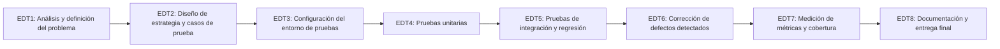

# 🗓️ Cronograma del Proyecto — Ampliación de Testing

Este documento describe el cronograma de la ampliación del proyecto **La Boletera** enfocada en incorporar un proceso de pruebas de software sobre el módulo crítico de venta de boletos (ver Puntos 1 y 2: problemática, matriz de riesgos, objetivo e hipótesis de testing).

## 1. Fases del proyecto (EDT / WBS)

| EDT | Fase | Descripción |
|---|---|---|
| EDT 1 | Análisis y definición del problema | Identificación de la problemática de calidad, matriz de riesgos, objetivo general e hipótesis de testing. |
| EDT 2 | Diseño de estrategia y casos de prueba | Diseño de casos de prueba de caja negra (valores límite) y caja blanca (cobertura de ramas) sobre `main.py`. |
| EDT 3 | Configuración del entorno de pruebas | Instalación de `pytest`, `TestClient`/`httpx`, `coverage.py` y configuración de un workflow de GitHub Actions (CI). |
| EDT 4 | Pruebas unitarias | Pruebas aisladas sobre validadores y modelos (`modelos.py`, esquemas Pydantic de `main.py`). |
| EDT 5 | Pruebas de integración y regresión | Pruebas end-to-end de los endpoints (`/autobuses/`, `/viajes/`, `/boletos/`) contra una base de datos SQLite en memoria. |
| EDT 6 | Corrección de defectos detectados | Fix de la condición de carrera en venta de boletos, estandarización de códigos HTTP y validaciones de entrada. |
| EDT 7 | Medición de métricas y cobertura | Cálculo de % de cobertura de sentencias, densidad de defectos y tasa de defectos escapados a producción. |
| EDT 8 | Documentación y entrega final | Actualización de la documentación y cierre de la ampliación. |

## 2. Duración estimada por fase

| Tarea (EDT) | Tiempo estimado |
|---|---|
| EDT 1 – Análisis y definición del problema | 4 horas |
| EDT 2 – Diseño de estrategia y casos de prueba | 5 horas |
| EDT 3 – Configuración del entorno de pruebas | 3 horas |
| EDT 4 – Pruebas unitarias | 6 horas |
| EDT 5 – Pruebas de integración y regresión | 6 horas |
| EDT 6 – Corrección de defectos detectados | 5 horas |
| EDT 7 – Medición de métricas y cobertura | 3 horas |
| EDT 8 – Documentación y entrega final | 3 horas |
| **Tiempo estimado total** | **35 horas** |

## 3. Roles del equipo

| Rol | Integrante | Funciones |
|---|---|---|
| Product Owner | Gael Martínez | Define el alcance de la ampliación, prioriza los riesgos a resolver y gestiona el backlog de pruebas. |
| Project Manager / Scrum Master | Gael Martínez | Organiza el cronograma, da seguimiento a los avances y elimina obstáculos del equipo. |
| Arquitecta de Software | Ana Torres | Diseña la solución a los defectos estructurales (transacciones atómicas, constraints de BD) y valida la estrategia de pruebas. |
| Backend Developer | Luis Hernández | Implementa las pruebas unitarias/integración y corrige los defectos detectados en `main.py` y `modelos.py`. |
| QA Engineer | Sofía Ramírez | Diseña los casos de prueba (caja negra/blanca), ejecuta la suite y mide cobertura y densidad de defectos. |
| DevOps | Diego Castillo | Configura `pytest`/`coverage` y el pipeline de CI en GitHub Actions para ejecutar pruebas en cada Pull Request. |

> Nota: al ser un equipo reducido, el rol de Product Owner y el de Project Manager son cubiertos por la misma persona.

## 4. Funciones por rol (detalle de actividades)

| Actividad | Descripción | Encargado |
|---|---|---|
| Tarea EDT1 | Analizar la problemática de calidad, construir la matriz de riesgos y definir el objetivo/hipótesis del proyecto. | Product Owner (Gael Martínez) |
| Tarea EDT2 | Diseñar los casos de prueba (valores límite para asientos/capacidad, cobertura de ramas de `main.py`) y el plan de pruebas. | QA Engineer (Sofía Ramírez) + Arquitecta de Software (Ana Torres) |
| Tarea EDT3 | Configurar `pytest`, `TestClient`, `coverage.py` y el workflow de GitHub Actions. | DevOps (Diego Castillo) |
| Tarea EDT4 | Implementar pruebas unitarias de validadores y modelos. | Backend Developer (Luis Hernández) |
| Tarea EDT5 | Implementar pruebas de integración/regresión sobre los endpoints REST. | Backend Developer (Luis Hernández) + QA Engineer (Sofía Ramírez) |
| Tarea EDT6 | Corregir la condición de carrera en venta de boletos, estandarizar códigos HTTP y agregar validaciones de entrada. | Arquitecta de Software (Ana Torres) + Backend Developer (Luis Hernández) |
| Tarea EDT7 | Medir cobertura de código, densidad de defectos y tasa de defectos escapados a producción. | QA Engineer (Sofía Ramírez) |
| Tarea EDT8 | Actualizar la documentación del proyecto y preparar la entrega final. | Project Manager (Gael Martínez) |
