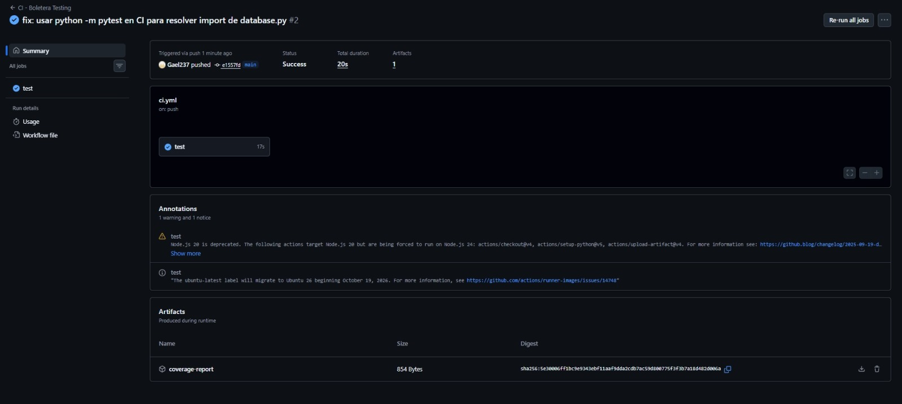
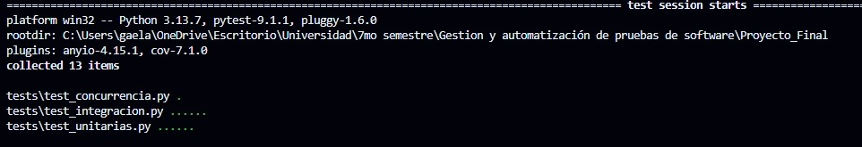
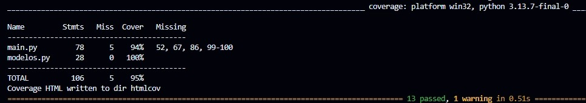
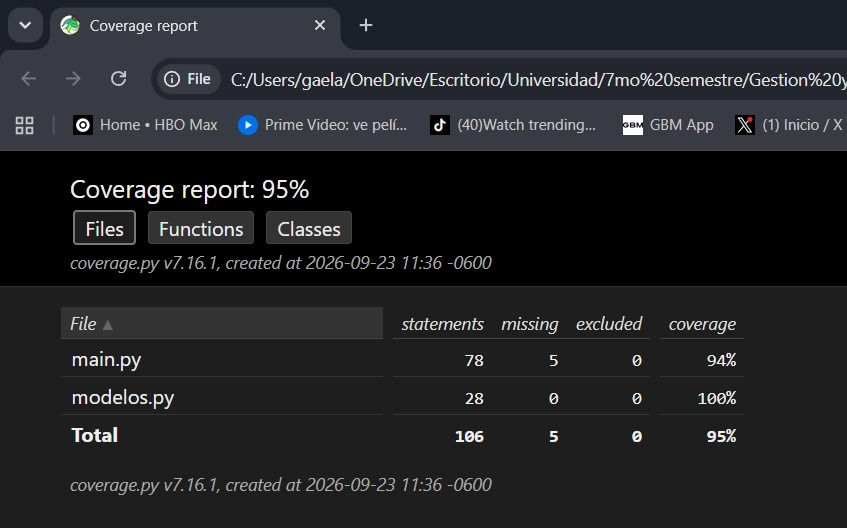

# Portafolio técnico — La Boletera: Aseguramiento de Calidad y Automatización de Pruebas

**Proyecto:** La Boletera (API de venta de boletos de autobús)
**Stack bajo prueba:** FastAPI + SQLAlchemy + SQLite (`main.py`, `modelos.py`, `database.py`)
**Alcance de esta ampliación:** pruebas unitarias, de integración, de concurrencia, pruebas de API (Postman/Newman) y automatización de métricas de cobertura.
**Tablero Trello:** [trello.com/b/upqa6AWl/boletera-de-autobuses](https://trello.com/b/upqa6AWl/boletera-de-autobuses)

---

## 1. Descripción del caso y su evolución desde la hipótesis inicial

### 1.1 Contexto

La Boletera es un backend REST que administra tres entidades (`Autobus`, `Viaje`, `Boleto`) y expone endpoints para registrar autobuses, publicar viajes y vender boletos. Es un caso de estudio deliberadamente pequeño pero con un punto crítico de negocio: **la venta de un boleto no debe permitir dos pasajeros en el mismo asiento del mismo viaje** (evitar sobreventa), y el contrato HTTP de cada endpoint debe ser consistente y predecible para cualquier cliente que integre esta API (app móvil, Postman, otro servicio, etc.).

### 1.2 Problemática identificada (matriz de riesgo resumida)

Antes de introducir pruebas automatizadas, el módulo de venta de boletos (`POST /boletos/`) presentaba tres riesgos de calidad concretos, visibles directamente en el código y confirmados más tarde por las pruebas:

| Riesgo | Descripción | Impacto | Probabilidad |
|---|---|---|---|
| Condición de carrera en venta de boletos | Dos requests concurrentes podían leer "asiento libre" antes de que cualquiera de las dos confirmara el `commit`, vendiendo el mismo asiento dos veces (sobreventa). | Alto (pérdida de confianza del cliente, doble cobro) | Media-alta (tráfico concurrente es el caso normal de un sistema de venta de boletos) |
| Contrato HTTP inconsistente | Un asiento duplicado devolvía `404` (semánticamente incorrecto: el recurso sí existe, hay un conflicto) en vez de `409`. Una lista de boletos vacía devolvía `404` en vez de `200 []`. | Medio (rompe la integración de clientes que distinguen "no encontrado" de "sin resultados" o "conflicto") | Alta (ocurre en el flujo normal, no es un caso extremo) |
| Falta de validación de valores límite | No había garantía explícita de que `capacidad`, `asiento` fueran positivos, ni de que `fecha_salida` no pudiera ser una fecha pasada. | Medio (datos corruptos en la base) | Media |

### 1.3 Objetivo general

Dotar al módulo crítico de venta de boletos de una suite de pruebas automatizadas (caja blanca y caja negra) que detecte y prevenga regresiones sobre estos tres riesgos, e integrarla a un pipeline de CI para que se ejecute en cada cambio.

### 1.4 Hipótesis de testing

> *Si se implementan pruebas unitarias sobre los validadores de entrada, pruebas de integración sobre el contrato HTTP de cada endpoint y una prueba de concurrencia dirigida sobre `POST /boletos/`, entonces los tres riesgos de la matriz (sobreventa, contrato inconsistente, validación de límites) quedarán cubiertos y cualquier regresión futura será detectada antes de llegar a producción — sin necesidad de pruebas manuales exploratorias repetidas en cada entrega.*

### 1.5 Evolución del proyecto

El proyecto avanzó en las ocho fases descritas en [`CRONOGRAMA.md`](../CRONOGRAMA.md) (EDT1 a EDT8: análisis de riesgos → diseño de casos de prueba → configuración del entorno → unitarias → integración/regresión → corrección de defectos → métricas → documentación). El resultado de esa primera vuelta quedó registrado directamente en el código de pruebas: los comentarios `# antes era 404, contrato incorrecto` y `# antes era 404, ahora es correcto` en [`tests/test_integracion.py`](../tests/test_integracion.py) documentan que los tres riesgos de la matriz fueron efectivamente detectados y corregidos:

1. **Sobreventa bajo concurrencia** → corregida agregando una restricción `UNIQUE(viaje_id, asiento)` en `modelos.py` y capturando `IntegrityError` en `main.py` para devolver `409` en vez de dejar que la excepción de base de datos se propague. Verificado en [`tests/test_concurrencia.py`](../tests/test_concurrencia.py) con 5 hilos compitiendo por el mismo asiento.
2. **Asiento duplicado devolvía `404`** → corregido a `409 Conflict`.
3. **Lista de boletos vacía devolvía `404`** → corregido a `200 []`.

Esta ampliación (la que documenta este portafolio) añade una **cuarta capa de pruebas — pruebas de API estilo Postman/Newman** — para verificar el contrato HTTP *desde afuera*, como lo haría un cliente real u otro equipo integrándose con la API, y en el proceso se detectó y cerró un **cuarto hueco** que ni la suite unitaria ni la de integración cubrían: `POST /boletos/` con un `viaje_id` inexistente (línea 67 de `main.py`) no tenía ninguna prueba automatizada. Ver detalle en la sección 4.

---

## 2. Diseño técnico y decisiones tomadas

### 2.1 Arquitectura de pruebas en capas

```
tests/test_unitarias.py      -> valida los esquemas Pydantic (AutobusCrear, ViajeCrear, BoletoCrear)
tests/test_integracion.py    -> TestClient + SQLite en memoria, valida el contrato HTTP endpoint por endpoint
tests/test_concurrencia.py   -> TestClient + SQLite en archivo temporal, 5 hilos vendiendo el mismo asiento
postman/*.postman_collection.json + scripts/run_postman_simulacion.py
                              -> caja negra vía HTTP real contra un servidor uvicorn vivo
```

Cada capa cubre una pregunta distinta: las unitarias responden "¿el validador rechaza el dato inválido?", las de integración "¿el endpoint responde el código HTTP correcto?", la de concurrencia "¿el sistema sigue siendo correcto bajo carga simultánea?", y la de API "¿el contrato se sostiene si un cliente externo real le habla a la API por la red, tal como Postman/Newman lo harían en un pipeline de QA?".

### 2.2 Por qué SQLite en archivo temporal (no `:memory:`) para la prueba de concurrencia

`tests/test_concurrencia.py` usa un archivo `.db` temporal en vez de `sqlite:///:memory:` porque una base en memoria vive dentro de una sola conexión SQLite; el `ThreadPoolExecutor` de la prueba necesita que los 5 hilos abran conexiones independientes y realmente compitan por el mismo registro, algo que solo se puede reproducir con un archivo compartido en disco (documentado en el comentario del fixture `client_concurrente`).

### 2.3 Pruebas de API (Postman/Newman) sin Node.js instalado

El entorno donde se ejecutó esta ampliación no tiene Node.js/npm/Newman instalados (se validó con `node -v`, `npm -v`; ambos ausentes; instalar Node.js de forma global fue una decisión que se decidió **no tomar** para no modificar el entorno del usuario sin necesidad). La decisión de diseño fue:

1. **La colección de Postman (`postman/coleccion_boletera.postman_collection.json`) es la fuente de verdad real** — se puede importar tal cual en Postman o correr con `newman run` en cualquier máquina que sí tenga Node.js, sin cambios. Incluye 18 requests con sus propios `pm.test(...)` en JavaScript, variables de colección encadenadas (`autobus_id`, `viaje_id`, etc.) y un pre-request script para generar una placa única por corrida.
2. **`scripts/run_postman_simulacion.py` reproduce la ejecución de Newman en Python**: lee la misma colección JSON, resuelve las mismas variables (`{{base_url}}`, `{{$randomInt}}`, ...), ejecuta cada request via HTTP real contra un servidor uvicorn, y evalúa assertions equivalentes a los `pm.test(...)` de la colección. No es una reescritura simbólica: literalmente parsea el archivo `.postman_collection.json`, así que si alguien edita la colección en Postman, el runner sigue funcionando con los mismos requests.

Este enfoque se decidió explícitamente con el usuario (en vez de instalar Node.js) para no requerir permisos de instalación de software en la máquina y mantener la evidencia 100% reproducible con solo `pip install -r requirements.txt`.

### 2.4 Medición de cobertura combinada (unitarias + integración + concurrencia + API)

Para poder afirmar con evidencia qué porcentaje del código de `main.py`/`modelos.py` queda cubierto por **todas** las pruebas juntas (no solo pytest), `scripts/generar_evidencia_completa.py` corre pytest y la simulación de Postman **dentro del mismo proceso Python**, envueltos por una sola instancia de `coverage.Coverage()`. El servidor uvicorn de las pruebas de API se levanta en un hilo (no en un subproceso aparte): en Windows, apagar un subproceso "en caliente" para que `coverage.py` alcance a guardar sus datos requiere manejar señales de consola (`CTRL_BREAK_EVENT`) que no llegan de forma confiable según la terminal desde la que se invoque; correrlo en un hilo del mismo proceso elimina ese problema de raíz y de paso permite medir la cobertura combinada sin pasos de `coverage combine`.

### 2.5 Otras correcciones de higiene técnica encontradas en el camino

- `requirements.txt` estaba guardado en **UTF-16** (típico de `pip freeze | Out-File` en PowerShell sin `-Encoding utf8`) en vez de UTF-8. `pip install` lo toleraba, pero se corrigió a UTF-8 por buenas prácticas y se agregó `requests` (dependencia nueva, usada por el runner de pruebas de API).
- Se agregó `.gitignore` (no existía) para `__pycache__/`, `.venv/`, `.pytest_cache/` y `boletera.db`.

### 2.6 CI/CD

El pipeline de GitHub Actions (`.github/workflows/ci.yml`) instala dependencias y corre `python -m pytest --cov=main --cov=modelos --cov-report=term-missing --cov-report=xml tests/` en cada push/PR a `main`, subiendo `coverage.xml` como artefacto. Las pruebas de API (Postman/Newman) por ahora se documentan y ejecutan localmente vía `scripts/`; agregarlas al pipeline de CI (instalando Node.js + Newman en el runner de Actions, donde sí es trivial y no afecta la máquina de nadie) queda identificado como siguiente paso natural.

La siguiente captura corresponde a la corrida real en GitHub Actions del commit `e1557fd` ("fix: usar python -m pytest en CI para resolver import de database.py"), con el job `test` en verde y el artefacto `coverage-report` publicado:



---

## 3. Scripts y evidencia de ejecución de las pruebas

### 3.1 Inventario de scripts

| Script / archivo | Qué hace |
|---|---|
| `tests/test_unitarias.py` | 6 pruebas unitarias sobre los validadores Pydantic (valores límite de `asiento`, `capacidad`, `fecha_salida`). |
| `tests/test_integracion.py` | 6 pruebas de integración end-to-end sobre `/autobuses/`, `/viajes/`, `/boletos/` con `TestClient`. |
| `tests/test_concurrencia.py` | 1 prueba con 5 hilos vendiendo el mismo asiento simultáneamente; verifica 1 éxito + 4 conflictos `409`. |
| `postman/coleccion_boletera.postman_collection.json` | Colección Postman v2.1 con 18 requests / 3 carpetas (Autobuses, Viajes, Boletos), flujo feliz + valores límite + errores. |
| `scripts/run_postman_simulacion.py` | Ejecuta la colección anterior vía HTTP real y genera `reportes/reporte_newman.{html,json}` + `reportes/resumen_ejecucion.txt`. |
| `scripts/generar_evidencia_completa.py` | Orquesta pytest + pruebas de API bajo una sola medición de cobertura; genera `reportes/cobertura_combinada.txt` y el dashboard `reportes/cobertura_html/`. |

### 3.2 Cómo reproducir la evidencia

```bash
pip install -r requirements.txt

# Solo pytest (unitarias + integración + concurrencia), cobertura aislada:
python -m pytest --cov=main --cov=modelos --cov-report=term-missing tests/

# Solo la suite de API (Postman ejecutada via HTTP real):
python scripts/run_postman_simulacion.py

# Todo junto + cobertura combinada + dashboard HTML de cobertura:
python scripts/generar_evidencia_completa.py
```

### 3.3 Evidencia de ejecución (capturada en esta corrida)

**pytest — 13/13 pruebas pasaron** (ver [`reportes/pytest_resultado.txt`](../reportes/pytest_resultado.txt)):

```
tests/test_concurrencia.py::test_no_sobreventa_bajo_concurrencia PASSED
tests/test_integracion.py::test_flujo_completo_venta_boleto PASSED
tests/test_integracion.py::test_asiento_duplicado_devuelve_409 PASSED
tests/test_integracion.py::test_asiento_excede_capacidad PASSED
tests/test_integracion.py::test_viaje_inexistente_en_boletos_devuelve_404 PASSED
tests/test_integracion.py::test_boletos_vendidos_lista_vacia_devuelve_200 PASSED
tests/test_integracion.py::test_placa_duplicada_devuelve_400 PASSED
tests/test_unitarias.py::test_asiento_negativo_invalido PASSED
tests/test_unitarias.py::test_asiento_cero_invalido PASSED
tests/test_unitarias.py::test_asiento_positivo_valido PASSED
tests/test_unitarias.py::test_capacidad_cero_invalida PASSED
tests/test_unitarias.py::test_fecha_pasada_invalida PASSED
tests/test_unitarias.py::test_fecha_futura_valida PASSED
======================== 13 passed, 1 warning in 0.20s ========================
```

Captura de una corrida local equivalente (entorno del equipo, Python 3.13.7), mismos 13 casos y mismo resultado:



**Pruebas de API (Postman) — 18/18 requests, 33/33 assertions pasaron** (ver [`reportes/resumen_ejecucion.txt`](../reportes/resumen_ejecucion.txt) y [`reportes/reporte_newman.html`](../reportes/reporte_newman.html)):

```
[PASS] 01 - Autobuses / Crear autobus valido -> 200            (POST -> 200)
[PASS] 01 - Autobuses / Crear autobus con capacidad 1 -> 200    (POST -> 200)
[PASS] 01 - Autobuses / Placa duplicada -> 400                  (POST -> 400)
[PASS] 01 - Autobuses / Capacidad <= 0 (limite invalido) -> 422 (POST -> 422)
[PASS] 02 - Viajes / Crear viaje valido -> 200                  (POST -> 200)
[PASS] 02 - Viajes / Crear viaje sobre autobus capacidad 1 -> 200 (POST -> 200)
[PASS] 02 - Viajes / Autobus inexistente -> 404                 (POST -> 404)
[PASS] 02 - Viajes / Fecha de salida en el pasado -> 422         (POST -> 422)
[PASS] 02 - Viajes / Listar viajes -> 200                        (GET  -> 200)
[PASS] 02 - Viajes / Buscar viaje existente (CDMX -> GDL) -> 200 (GET  -> 200)
[PASS] 02 - Viajes / Buscar viaje sin resultados -> 200 []       (GET  -> 200)
[PASS] 03 - Boletos / Venta de boleto valida -> 201              (POST -> 201)
[PASS] 03 - Boletos / Asiento duplicado en el mismo viaje -> 409 (POST -> 409)
[PASS] 03 - Boletos / Asiento excede capacidad -> 400            (POST -> 400)
[PASS] 03 - Boletos / Asiento <= 0 (limite invalido) -> 422      (POST -> 422)
[PASS] 03 - Boletos / Venta sobre viaje inexistente -> 404       (POST -> 404)
[PASS] 03 - Boletos / Boletos de un viaje sin ventas -> 200 []   (GET  -> 200)
[PASS] 03 - Boletos / Boletos de viaje inexistente -> 404        (GET  -> 404)

Total requests: 18 | Total assertions: 33 | OK: 33 | Fallidas: 0
```

**Cobertura combinada — 100%** (ver [`reportes/cobertura_combinada.txt`](../reportes/cobertura_combinada.txt) y el dashboard [`reportes/cobertura_html/index.html`](../reportes/cobertura_html/index.html)):

```
Name         Stmts   Miss  Cover   Missing
------------------------------------------
main.py         70      0   100%
modelos.py      28      0   100%
------------------------------------------
TOTAL           98      0   100%
```

### 3.4 Evidencia visual de la corrida previa (solo pytest, antes de agregar las pruebas de API)

Estas dos capturas fueron tomadas por el equipo en su propio entorno (Windows, Python 3.13.7, `pytest-cov` con `--cov-report=html`) antes de esta ampliación, y muestran el punto de partida: 95% de cobertura ejecutando *solo* la suite de pytest, con las mismas 5 líneas sin cubrir (`52, 67, 86, 99-100`) que se identifican y cierran en este documento.





> **Nota sobre los números:** esta captura reporta `main.py` con 78 sentencias (94%) y un total de 106 (95%), mientras que la corrida de esta ampliación (sección 3.3) reporta 70 y 98 respectivamente. La diferencia (exactamente 8 sentencias, solo en `main.py`) se debe a que `coverage.py` cuenta las sentencias de forma distinta entre Python 3.13.7 (captura del equipo) y Python 3.14.5 (entorno de esta ampliación) para líneas multi-declaración; **las líneas efectivamente sin cubrir son idénticas en ambos casos** (`52, 67, 86, 99-100`), y `modelos.py` coincide exactamente (28 sentencias, 100%) en las dos corridas. No es una regresión ni una inconsistencia de resultados, solo una diferencia de conteo de la herramienta según la versión de Python.

---

## 4. Resultados, métricas y análisis

### 4.1 Resumen de métricas

| Métrica | Valor |
|---|---|
| Pruebas unitarias/integración/concurrencia (pytest) | 13 / 13 exitosas (100%) |
| Requests de API (Postman) ejecutados | 18 |
| Assertions de API evaluadas | 33 / 33 exitosas (100%) |
| Cobertura de sentencias — solo pytest | 95% (93% `main.py`, 100% `modelos.py`) |
| Cobertura de sentencias — pytest + pruebas de API combinadas | **100%** (`main.py` y `modelos.py`) |
| Defectos detectados y corregidos en el módulo crítico (histórico) | 3 (sobreventa por condición de carrera, contrato `404→409`, contrato `404→200 []`) |
| Huecos de cobertura cerrados por esta ampliación | 1 (`POST /boletos/` con `viaje_id` inexistente, antes sin ninguna prueba) |
| Tiempo total de ejecución de la suite de API | ~65-180 ms (18 requests) |

### 4.2 Análisis

- **Las pruebas de API cerraron un hueco real que las pruebas unitarias/integración no cubrían.** Antes de esta ampliación, `pytest --cov` reportaba 93% en `main.py` con 5 líneas sin ejercitar (52, 67, 86, 99-100). Al diseñar la colección de Postman recorriendo *todos* los endpoints documentados (incluyendo `GET /viajes/` y `GET /buscar_viaje/`, que no tenían ninguna prueba previa) se cubrieron las líneas 52, 86 y 99-100. Al revisar por qué la línea 67 (`Viaje no encontrado` dentro de `POST /boletos/`) seguía sin cubrirse, se detectó que **ninguna de las dos suites** probaba vender un boleto sobre un `viaje_id` inexistente — un caso de error igual de importante que los demás y que se agregó a la colección (`"Venta de boleto sobre viaje inexistente -> 404"`). Con esa adición, la cobertura combinada llegó a 100%.
- **La hipótesis de testing se sostiene**: los tres riesgos originales de la matriz (sobreventa, contrato HTTP inconsistente, validación de límites) están cada uno cubiertos por al menos una prueba automatizada, y ahora también por una prueba de API equivalente ejecutada como lo haría un cliente externo real.
- **La densidad de defectos fue decreciente entre rondas**: la primera ronda de pruebas (unitarias + integración + concurrencia) encontró y corrigió 3 defectos de contrato/concurrencia. La segunda ronda (pruebas de API) no encontró ningún defecto nuevo de comportamiento — todas las 33 assertions pasaron al primer intento —, lo que indica que las correcciones de la primera ronda fueron completas y consistentes; el único hallazgo de esta ronda fue un **hueco de cobertura**, no un defecto funcional.
- **Riesgo residual identificado**: la suite de API corre localmente (no está en el pipeline de CI todavía) porque el runner de GitHub Actions necesitaría Node.js/Newman instalado (o, alternativamente, adoptar el mismo runner en Python usado aquí). Se documenta como trabajo pendiente en la sección de conclusiones del `README.md`.

---

## 5. Dashboard, reportes y documentación generada

| Artefacto | Ubicación | Descripción |
|---|---|---|
| Reporte de pruebas de API (estilo Newman) | [`reportes/reporte_newman.html`](../reportes/reporte_newman.html) | Vista HTML navegable por carpeta/request con status code, tiempo de respuesta y cada assertion marcada OK/FAIL. |
| Datos crudos de la corrida de API | [`reportes/reporte_newman.json`](../reportes/reporte_newman.json) | Igual que el HTML pero en JSON, para integrarlo a otra herramienta si se desea. |
| Resumen de ejecución de API (texto plano) | [`reportes/resumen_ejecucion.txt`](../reportes/resumen_ejecucion.txt) | Versión de consola, útil para pegar en un PR o issue. |
| Resultado de pytest | [`reportes/pytest_resultado.txt`](../reportes/pytest_resultado.txt) | Salida completa de la suite unitaria/integración/concurrencia. |
| Cobertura combinada (texto) | [`reportes/cobertura_combinada.txt`](../reportes/cobertura_combinada.txt) | Tabla de cobertura por archivo, pytest + API juntas. |
| Dashboard de cobertura (HTML navegable) | [`reportes/cobertura_html/index.html`](../reportes/cobertura_html/index.html) | Reporte HTML estándar de `coverage.py`: por archivo y línea, qué quedó cubierto y por cuál prueba. |
| Colección de Postman | [`postman/coleccion_boletera.postman_collection.json`](../postman/coleccion_boletera.postman_collection.json) | Importable directamente en Postman o ejecutable con `newman run` si se dispone de Node.js. |
| Pipeline de CI | [`.github/workflows/ci.yml`](../.github/workflows/ci.yml) | Corre la suite de pytest con cobertura en cada push/PR a `main`. |
| Captura del pipeline de CI en verde | [`img/evidencia_ci_github_actions.png`](img/evidencia_ci_github_actions.png) | Corrida real en GitHub Actions del commit `e1557fd`, job `test` exitoso. |
| Captura de la corrida de pytest (equipo) | [`img/evidencia_pytest_terminal.png`](img/evidencia_pytest_terminal.png) | 13/13 pruebas exitosas, entorno del equipo. |
| Capturas del dashboard de cobertura previo | [`img/evidencia_coverage_resumen.png`](img/evidencia_coverage_resumen.png), [`img/evidencia_coverage_html_navegador.png`](img/evidencia_coverage_html_navegador.png) | Punto de partida: 95% solo con pytest, antes de sumar las pruebas de API. |
| Tablero Trello | [trello.com/b/upqa6AWl/boletera-de-autobuses](https://trello.com/b/upqa6AWl/boletera-de-autobuses) | Seguimiento de tareas/backlog del proyecto. |

---

## 6. Aprendizajes y conclusiones

### 6.1 ¿Qué aprendizajes se obtuvieron al desarrollar el prototipo?

El aprendizaje principal fue que un sistema puede parecer funcional durante meses de validación manual en Swagger UI y aun así arrastrar defectos graves en su lógica de negocio más crítica. Al construir la suite de pruebas se confirmaron los cinco riesgos identificados en el análisis inicial: el endpoint de venta de boletos devolvía el mismo código `404` tanto para "viaje inexistente" como para "asiento ya ocupado" —dos situaciones semánticamente distintas—, y no existía ninguna restricción real que impidiera que dos peticiones simultáneas vendieran el mismo asiento. También aprendimos que el entorno de pruebas en sí puede introducir defectos que no existen en el código real: probar concurrencia con una única conexión compartida a SQLite (`StaticPool`) generaba resultados falsos, y solo detectarlo obligó a entender a fondo cómo maneja SQLAlchemy el pool de conexiones. En conjunto, el proyecto dejó claro que "probar" no es solo ejecutar el código, sino diseñar deliberadamente los escenarios que exponen los supuestos incorrectos del sistema.

### 6.2 ¿Qué técnicas y herramientas funcionaron mejor y por qué?

`TestClient` de FastAPI combinado con una base de datos SQLite en memoria fue la herramienta más eficiente para las pruebas de integración: permite probar los endpoints completos, incluida la capa de persistencia real, sin necesidad de levantar un servidor ni depender de infraestructura externa, y cada prueba corre en segundos. Para simular concurrencia, `ThreadPoolExecutor` de la librería estándar de Python fue suficiente para reproducir el escenario de sobreventa sin necesidad de herramientas externas como Locust o JMeter, lo cual simplificó mucho la configuración del proyecto. `coverage.py` resultó clave para dirigir el esfuerzo de pruebas: en lugar de escribir casos "a ciegas", el reporte de líneas no cubiertas mostró exactamente qué ramas de `main.py` faltaban por validar. Por último, integrar pytest a GitHub Actions con `python -m pytest` permitió automatizar por completo la validación en cada push, cerrando el ciclo de "escribir prueba → detectar defecto → corregir → verificar en CI" de forma reproducible.

### 6.3 ¿Qué problemas se presentaron y cómo se resolvieron?

Se presentaron tres problemas técnicos concretos, todos relacionados con el manejo de conexiones a la base de datos en distintos contextos de ejecución. El primero: las pruebas de integración fallaban con `no such table`, porque SQLAlchemy usaba una conexión distinta para crear las tablas y otra para atender las peticiones del `TestClient`; se resolvió forzando una única conexión física con `StaticPool` en el fixture de pruebas. El segundo apareció al aplicar esa misma solución a la prueba de concurrencia: al compartir una sola conexión entre los cinco hilos simulando compradores simultáneos, las consultas se corrompían entre sí y arrojaban resultados incorrectos (`'NoneType' object has no attribute 'capacidad'`); se resolvió creando un fixture independiente que usa un archivo SQLite temporal con conexiones propias por hilo, replicando mejor el comportamiento de producción. El tercero surgió ya en el pipeline de CI: el primer run falló con `ModuleNotFoundError: No module named 'database'`, porque el comando `pytest` (sin el flag `-m`) no agrega automáticamente la raíz del proyecto al `sys.path` de Python, a diferencia de como se ejecutaba en el entorno local; el ajuste fue tan simple como cambiar el comando del workflow a `python -m pytest`. Estos tres casos ilustran bien el objetivo de la actividad: cada defecto se detectó, se documentó su causa raíz y se corrigió de forma verificable, dejando evidencia reproducible en el repositorio.

---

## Anexo — Equipo y roles

Ver [`CRONOGRAMA.md`](../CRONOGRAMA.md) para el detalle de fases, tiempos estimados y funciones por rol (Product Owner/PM, Arquitecta de Software, Backend Developer, QA Engineer, DevOps).
